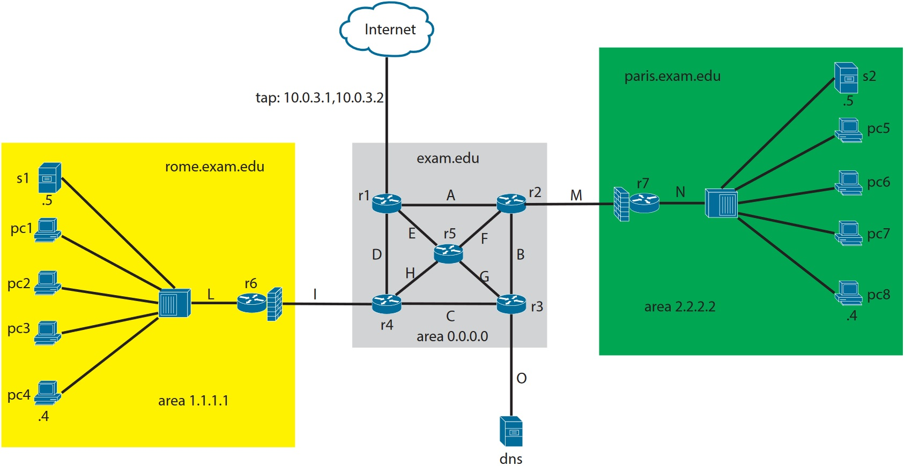

# NETKIT virtula network

Set up of the topology on virtual network called NetKit.

Currently netkit is not supported anymore, the new version is called [Katarah](https://www.netkit.org/).

This is one of my Master course project in networking.

|Collition domain |Subnet |
|-	|-	|
|A  	|1.0.1.2/31  	|
|B  	|1.0.1.4/31  	|
|C  	|1.0.1.6/31  	|
|D  	|1.0.1.8/31  	|
|E  	|1.0.1.10/31  |
|F  	|1.0.1.12/31  |
|G  	|1.0.1.14/31  |
|H  	|1.0.1.16/31 	|
|I  	|1.0.1.18/31 	|
|L  	|192.168.1.0/24 	|
|M  	|20.0.1.2/31  	|
|N  	|192.168.2.0/24  	|
|O  	|20.0.1.4/31  	|

Given  the  topology  in  figure,  reproduce  it  in  netkit.   You  must  use  the  VM  names  andaddresses specified in the figure above.For /31 subnets, the addresses are assigned with the following rule:  the lower router numbertakes the even address, e.g.  r1 takes 1.0.1.2 with respect to r2.

The maximum points are 10+2 and are assigned as follows:

- +0.5 points:  lab created with folders and lab.conf

- +0.5 points:  r6 and r7 are DHCP Servers.  Hosts on L and N are DHCP clients excepts1, pc4, s2 and pc8 (use static static for them).

- +1 point:  Configure the TAP interface and set default gateways on routers in order touse the TAP.

- +2 points:  OSPF on every router (and only on them) in order to have dynamic routing.Respect the areas given in figure and keep in mind the default gateways for the TAP.

- +1 point:  Create a user calledcuserwith passworduseron every router and allow s1to access the routers trough ssh via asymmetric authentication.  (This must be doneat startup)

- +1 point:  Setup a VPN between pc4 and pc8 (with pc8 as server).  Use the same UDPport we have used on lecture.  The CA for this VPN is s2.

- +2 points:   Configure  firewall  on  r6  and  r7  to  accept  the  incoming  trafficonlyif  isinitialized by the respective subnets (L and N). Set s1 and s2 in DMZ. Add exceptionsfor the services you have setup until now (SSH and VPN).

- +2  points:   Configure  DNS  as  name  server.   DNS  is  authoritative  forexam.eduanddelegatesrome.exam.eduto  s1  andparis.exam.eduto  s2.   Every  host  must  be  reach-able  by  hits  hostname.domain,  eg:r1→r1.exam.edu,pc4→pc4.rome.exam.edu,pc8→pc8.paris.exam.edu.  Every host must use DNS as name server (not s1 and s2!).

Extra points:

- +1 point:  Setup a webserver (the plain page of apache2 It Works!  it’s fine) on pc7 onport 8080

- +1 point:  Using iptables, redirect the TCP port 80 of r7 to the TCP port 8080 of pc7.

Restart for all the daemons is required.
